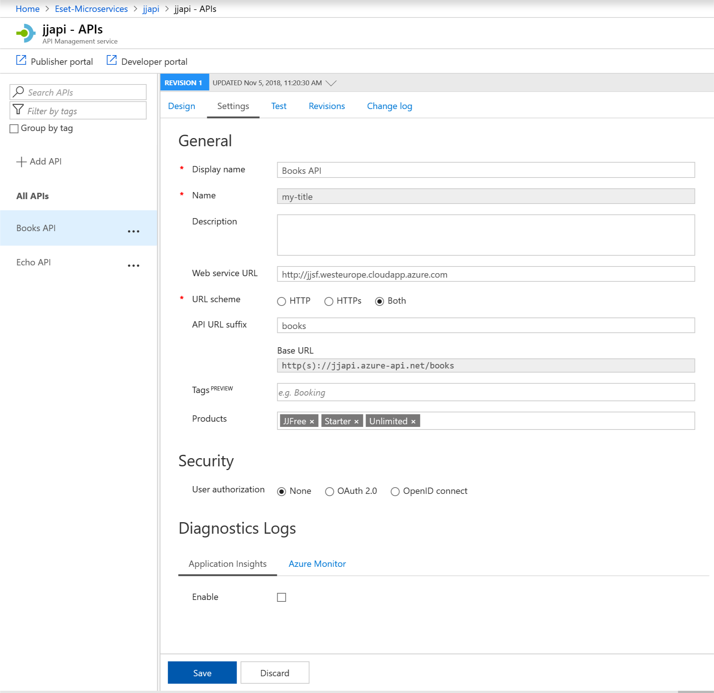

# JJ AngularWeb using Angular calling back-end API with Azure API management

SinglePage Angular web application calling back-end rest API published with API management. Backend API is secured using bearer tokens from Azure Active Directory .

TODO:

- Multiple API services (now only Books) - check https://github.com/jjindrich/jjazure-web-angular-apimanagement/pull/1
- Host API in Docker using Azure Mesh

Design for development

- all API services will be published with public IP
- API services publish with Azure API Management

Design for production

- all API services are deployed into virtual network
- API services publish with Azure API Management connected to virtual network

 Why use Azure API management - [Direct communication vs API management](https://docs.microsoft.com/en-us/dotnet/standard/microservices-architecture/architect-microservice-container-applications/direct-client-to-microservice-communication-versus-the-api-gateway-pattern)

If you will not use API management, you have to implement security checks on your API services directly.

- [Protect your API](https://docs.microsoft.com/en-us/azure/api-management/transform-api)
- [Combine with Azure Application Gateway](https://docs.microsoft.com/en-us/azure/api-management/api-management-howto-integrate-internal-vnet-appgateway)

## Create frontend web

### Create Angular project with Visual Studio Code

I created SinglePage Angular (SPA) web project

How to create new Angular project (with routing) - [Using Angular in Visual Studio Code](https://code.visualstudio.com/docs/nodejs/angular-tutorial)

Tutorial for Angular - [Angular Tutorial](https://angular.io/tutorial/toh-pt0)

Use Material Design - [Angular Material](https://material.angular.io/guide/getting-started)

Run web on localhost, open browser with http://localhost:4200

```bash
cd jjweb
ng serve --open
```

### Add Azure Active Directory to Angular web project

Make sure you have your Azure Active Directory, my is jjdev.onmicrosoft.com

Add Azure Active Directory Sing-in - [Angular use ADAL](https://docs.microsoft.com/en-us/azure/active-directory/develop/quickstart-v1-angularjs-spa)

Example for Angular6 - [Adal-Angular6](https://github.com/benbaran/adal-angular6-example)

Steps to configure Azure Active Directory

1. Add App registration - type https://localhost:42000/
2. Change manifest to oauth2AllowImplicitFlow: true
3. Grant permissions for application

```bash
npm install --save adal-angular4
```

Change source code

1. Change your tenant and clientId in environment settings - yourdomain.onmicrosoft.com and applicationId

Run web on HTTPS localhost (required for claim based auth), open browser with https://localhost:4200

```bash
cd jjweb
ng serve --ssl --open
```

Open browser and check JWT token after successful sign-in. Decode token with [jwt.io](https://jwt.io/).

## Create API backend

I prepared two options how to create API backend

1. Using platform service Azure API App (Web App) - easier to deploy
2. Using microservice cluster Azure ServiceFabric - more complex to create cluster but with lof of advantages from deployment perspective

### Create API project with Visual Studio hosted in Azure Web App

I created DotNet Core API project jjapi and published to Azure API App.

How to add Swagger - [NSwag](https://docs.microsoft.com/en-us/aspnet/core/tutorials/getting-started-with-nswag?view=aspnetcore-2.1&tabs=visual-studio%2Cvisual-studio-xml)

Configure Azure API App (Web App)

1. Swagger link must be updated on API App - API Definition blade - type https://jjapiapp.azurewebsites.net/swagger/v1/swagger.json
2. You will get this API URL: https://jjapiapp.azurewebsites.net/api/books
3. Update CORS url on WebApp based on your web client jjweb, like http://localhost:4200
4. Update SPA project with this url, file main.ts

### Create API project with Visual Studio hosted in Azure ServiceFabric

I created Stateless ASP.Net Core API project jjapisf and published to Azure ServiceFabric jjsf.westeurope.cloudapp.azure.com

[Hosting ASP.Net Core in ServiceFabric](https://docs.microsoft.com/en-us/azure/service-fabric/service-fabric-reliable-services-communication-aspnetcore)

Warning: now using Kestrel, limited for multiple services running on same port

Configure Azure ServiceFabic

1. Create with published ports 80, 443
2. Import PFX/PEM certificate into your user certificate store
3. Publish Visual Studio project jjapisf to Azure ServiceFabric

Your service will be available on http://jjsf.westeurope.cloudapp.azure.com/api/books

## Publish API backend with Azure API management

Provision Azure API Management, my is jjapi

- Developer plan is limited, you cannot connect to virtual network for backend services
- Premium plan is production ready, you can connect to virtual network for backend services

### Publish Books API with Azure API management

Open API Management service add new API (one of them)

1. Open API specification (for ServiceFabric deployment) - type http://jjsf.westeurope.cloudapp.azure.com/swagger/v1/swagger.json
2. Open API App - select API App Azure resource with configured API definition
3. Create new plan Free (for testing) - will not require subscription
4. Setup policy for CORS - click Add policy CORS for Inbound processing or [CORS](https://docs.microsoft.com/en-us/azure/api-management/api-management-cross-domain-policies)
5. Check API settings for URL scheme to HTTPs or Both
6. Update SPA project with this url, file main.ts - type https://jjapi.azure-api.net/books/api/books




### Secure Books API with Azure Active Directory

[Protect API with Azure AD](https://docs.microsoft.com/en-us/azure/api-management/api-management-howto-protect-backend-with-aad)

Configuration of API management

1. Create Application registration in your Azure Active Directory, type jjapi
2. TODO